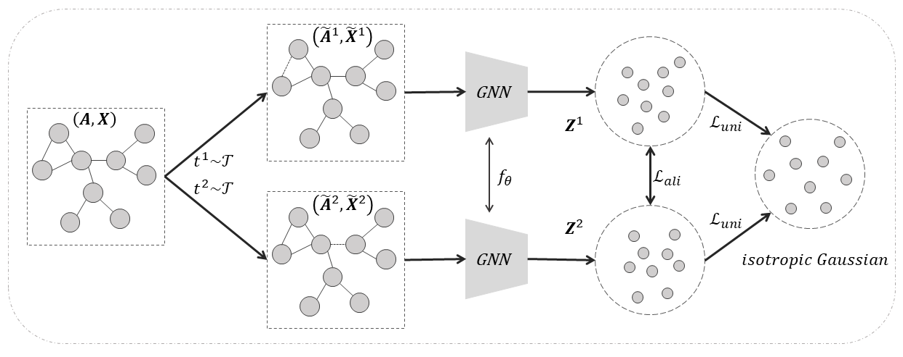

# Negative-Free Self-Supervised Gaussian Embedding of Graphs

Official Implementation of Negative-Free Self-Supervised Gaussian Embedding of Graphs.

## Abstract

**Figure 1: Overview of our proposed graph contrastive learning framework SSGE.** For a given attributed graph, we first generate two distinct views through random augmentations: edge dropping and feature masking. These two views are subsequently fed into a shared GNN encoder to extract node representations. The *alignment* loss and the Gaussian distribution guided *uniformity* loss function are applied on the batch-normalized representation matrix of the two views.

## Dependencies

- dgl
- torch
- scikit-learn

## Reproduction

Copy hyper-parameters from [params.txt](./params.txt) to [main.py](./main.py) and run it.

## Datasets

For all datasets, we use the processed version provided by [Deep Graph Library](https://github.com/dmlc/dgl).

| Dataset    | Type          | #Nodes | #Edges  | #Features | #Classes |
| ---------- | ------------- | ------ | ------- | --------- | -------- |
| Cora       | citation      | 2,708  | 10,556  | 1,433     | 7        |
| Citeseer   | citation      | 3,327  | 9,228   | 3,703     | 6        |
| Pubmed     | citation      | 19,717 | 88,651  | 500       | 3        |
| WikiCS     | reference     | 11,701 | 431,726 | 300       | 10       |
| Computer   | co-purchase   | 13,752 | 491,722 | 767       | 10       |
| CoauthorCS | co-authorship | 18,333 | 163,788 | 6,805     | 15       |